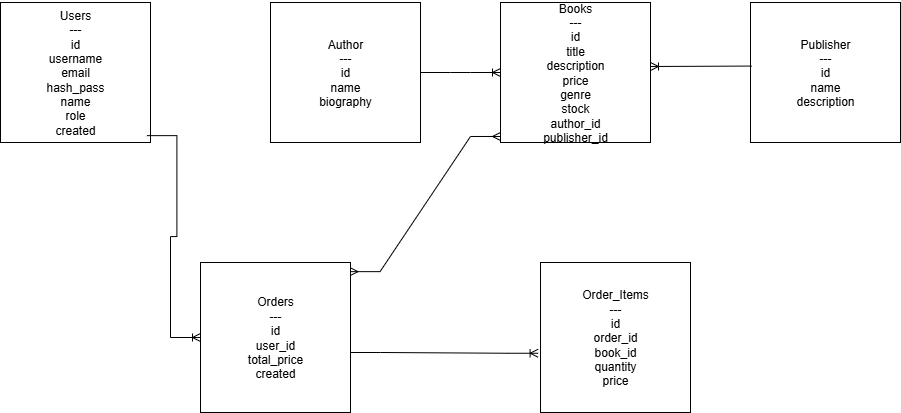

# Bookstore

## Description
This is a bookstore application where users can browse books, search by title or author, filter by genre or publisher, and create orders.

## REST API Endpoints
### Books
- `GET /api/books`  
  Returns a list of books.  
  **Parameters:** `title`, `author`, `genre`, `publisher`, `sort`  
  **Response:** `200 OK` with JSON list of books

- `GET /api/books/:id`  
  Returns detailed information about a book.  

### Authors
- `GET /api/authors` – list of authors  
- `GET /api/authors/:id` – author details with books  

### Publishers
- `GET /api/publishers` – list of publishers  
- `GET /api/publishers/:id` – publisher details with books  

### Users & Auth
- `POST /api/auth/register` – register new user  
- `POST /api/auth/login` – login  
- `GET /api/users/me` – user profile  
- `PUT /api/users/me` – update profile  

### Orders
- `POST /api/orders` – create order  
- `GET /api/orders` – get user’s orders  
- `GET /api/orders/:id` - get details about order

---

## Database Schema

